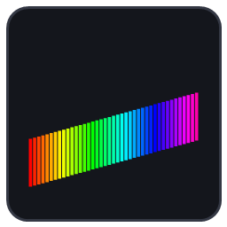

<p align="center">
  
</p>

<h1 align="center">Secretlab MAGRGB — SignalRGB plugin</h1>

<p align="center">
  Real-time, <b>per-zone</b> RGB sync for the Secretlab MAGRGB lightstrip
  (Nanoleaf <code>NL72S2</code>), alongside the rest of your SignalRGB devices.
</p>

---

SignalRGB has no support for the Secretlab series of Nanoleaf devices — the built-in
Nanoleaf integration pairs the strip but shows **zero lighting zones**. This plugin talks
to it directly over Nanoleaf's external-control protocol and gives you all **41 zones**
at 30 fps.

## Install

Add this repository as a SignalRGB addon:

```
https://github.com/Pop-Code/Secretlab-MagRGB-SignalRGB-plugin
```

SignalRGB → Devices → Addons → add the URL. It clones the repo and picks up
`network/SecretlabMAGRGB/`. Restart SignalRGB if the device service doesn't appear.

## Setup

You need two things: the strip's **IP address** and an **auth token**. One script gets both.

```powershell
powershell -ExecutionPolicy Bypass -File tools\magrgb-setup.ps1
```

It will:

1. **Find the strip** on your LAN via mDNS and print its IP, model and firmware.
2. **Get a token** — see the pairing step below.
3. **Verify** by streaming test colours to the strip so you know it works.

The token is saved to `tools/magrgb-token.json` (gitignored) and printed at the end.

### The pairing step

The strip's local API is locked by default. Unlocking it needs two commands that only
exist on Nanoleaf's proprietary LTPDU channel, so this part needs the Nanoleaf Desktop
app **once**:

1. Start `magrgb-setup.ps1` — it polls for 45 seconds.
2. While it's polling, open **Nanoleaf Desktop**, select the strip, turn **Enable API**
   **ON**, then press **Connect to API**.

> Both steps matter. `Enable API` turns the API server on; `Connect to API` opens a
> 30-second window in which a token can be minted. Pressing only the second gives
> **HTTP 403**.

The plugin itself can also do this — leave the token blank in its panel and it polls for
the window on its own. The script just lets you confirm everything outside SignalRGB.

**This is needed once, ever.** The token persists on the device and in SignalRGB across
reboots, power cycles and app restarts. Only a factory reset requires redoing it.

### Finally

In SignalRGB → **Secretlab MAGRGB (Nanoleaf)**:

1. Enter the IP → **Add**
2. Paste the token → **Save**  *(or leave blank and use the pairing window)*

The strip appears with 41 addressable zones. No component to assign, no LED count to set.

## Settings

| Setting | Default | Notes |
|---|---|---|
| Lighting Mode | Canvas | `Forced` locks the whole strip to one colour |
| Update rate | 30 fps | Drop to 20 if it stutters |
| Reverse direction | on | Turn off if effects run backwards |
| Transition | 0 | ×100 ms; 0 is lowest latency |
| Turn strip OFF on shutdown | off | |

## Other MAGRGB sizes

Zone counts are pinned per model in `MODEL_ZONES`, because the strip does not report its
own layout. `NL72S2` (the 2 m strip) has 41. If you have a different one — the XL, for
instance — find your count with:

```powershell
powershell -ExecutionPolicy Bypass -File tools\magrgb-zones.ps1 -Start 40 -Ceiling 48
```

Press Enter to add a zone, `p` to remove one, until the whole strip lights with nothing
left over. Then open an issue with your model and count and it'll be added.

---

## How it works

```
SignalRGB canvas
      │  device.color(x, 0) × 41
      ▼
plugin  ──HTTP PUT /api/v1/<token>/effects──►  arm extControl v2   (TCP 16021)
        ──UDP extControl v2 frames──────────►  41 zones @ 30 fps   (UDP 60222)
```

The strip is a Nanoleaf Essentials-class device speaking three protocols:

| Port | Protocol | Used for |
|---|---|---|
| 16021/TCP | Nanoleaf OpenAPI (`_nanoleafapi._tcp`) | pairing, arming extControl |
| 60222/UDP | Nanoleaf external control v2 | the pixel stream |
| 12566/TCP | LTPDU (proprietary, encrypted) | unlocking the OpenAPI, effects |

### Why not Matter?

The product is sold as Matter-over-Wi-Fi, and that was the first thing investigated. It
is a dead end for this purpose:

- The unit advertises only `_nanoleafapi._tcp` and `_ltpdu._tcp` over mDNS. There is **no
  `_matter._tcp` operational service**, so it isn't on a Matter fabric at all unless you
  commission it as one.
- Every Nanoleaf product in the CSA Distributed Compliance Ledger (vendor ID `0x115A`) is
  certified as device type `0x010D` — **Extended Color Light**. One endpoint,
  OnOff / LevelControl / ColorControl. That includes the 2026 Secretlab ErgoArch on
  Matter 1.4 firmware.
- Matter through 1.5.1 has **no multi-zone lighting device type and no streaming
  transport**. It cannot express per-zone control, at any version, for any vendor.

So Matter would get you one solid colour. extControl gets you 41 zones.

### extControl v2 frame format (big-endian)

```
uint16  panelCount
repeat panelCount times:
    uint16  panelId
    uint8   R, G, B, W
    uint16  transitionTime      (units of 100 ms; 0 = instant)
```

### Measured device behaviour (firmware 4.0.0, hardware 1.3.0)

- **41 addressable zones**, panel IDs `0..40`.
- **Panel ID 0 is at the right-hand end.** The plugin reverses the mapping by default so
  the SignalRGB canvas isn't mirrored.
- `GET /panelLayout/*` returns **HTTP 500** — not implemented on this 1D device. Hence
  the hardcoded zone counts.
- A frame containing **any out-of-range panel ID is rejected in full**, not partially
  applied. Never send more than the zone count.
- extControl **only updates the zones present in the frame**; every other zone keeps its
  previous colour. The plugin always sends all 41, so stale zones never happen.
- `PUT /effects` with extControl v2 replies **204**, after which `GET /effects/select`
  reads `"*ExtControl*"`.

### Unlocking the OpenAPI

```
POST openapi/enable [1]    turns the OpenAPI server on      (LTPDU, port 12566)
POST openapi/pair   [1]    opens a 30-second /api/v1/new window
```

Both are LTPDU-only, which is why Nanoleaf Desktop is needed for that one step. A
standalone LTPDU client would remove the dependency entirely — contributions welcome.

---

## Files

```
network/SecretlabMAGRGB/SecretlabMAGRGB.js     the plugin
network/SecretlabMAGRGB/SecretlabMAGRGB.qml    its panel in the SignalRGB UI
tools/magrgb-setup.ps1                         discover + pair + verify
tools/magrgb-zones.ps1                         interactive zone-count finder
assets/icon.png                                plugin icon
```

**No credentials are stored in this repository.** Tokens live only in SignalRGB's own
settings store and in the gitignored `tools/magrgb-token.json`.

> When running the tools, close SignalRGB first — both stream to the same strip and will
> fight over it.

## Troubleshooting

| Symptom | Cause |
|---|---|
| `HTTP 403` when pairing | `Enable API` was never switched on, or the 30 s window closed |
| Setup finds nothing | VPN adapter picked instead of your LAN — pass `-LocalIp <your IP>`; or AP isolation / guest VLAN; or firewall blocking UDP 5353 |
| Effects run backwards | Turn off **Reverse direction** |
| Strip stutters | Lower the update rate to 20 fps |
| Colours freeze | Something else grabbed the stream (Nanoleaf Desktop's Screen Mirror). The plugin re-arms every 10 s; don't run both |

## Licence

MIT — see [LICENSE](LICENSE).

Not affiliated with Secretlab or Nanoleaf. Protocol details were obtained by inspecting
the locally-installed Nanoleaf Desktop application and by direct observation of the
device on the local network.
